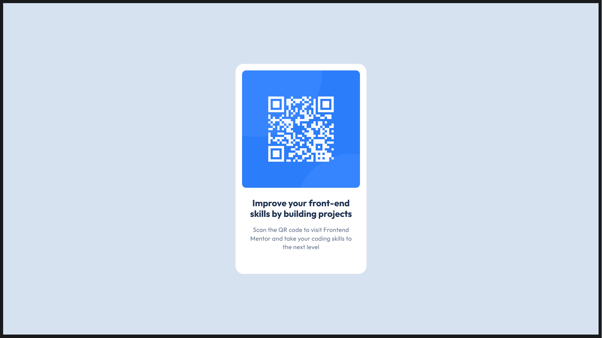

# Frontend Mentor - QR code component solution

This is my solution to the [QR code component challenge on Frontend Mentor](https://www.frontendmentor.io/challenges/qr-code-component-iux_sIO_H).

## Overview



### Links

- Solution URL: [My solution URL](https://www.frontendmentor.io/solutions/css-flexbox-css-variables-iRxyhIpmBu)
- Live Site URL: [Live site URL](https://qr-code-project-inky.vercel.app)

## My process

### Built with

- Semantic HTML5 markup
- CSS custom properties
- Flexbox

### What I learned

Here I used CSS Variables for the first time, and it made the color assigning code a lot more readable, which I've always found a bit annoying, so I'm glad this function exists.

```css
:root {
  --white: hsl(0, 0%, 100%);
  --slate300: hsl(212, 45%, 89%);
  --slate500: hsl(216, 15%, 48%);
  --slate900: hsl(218, 44%, 22%);
}
```

```css
body {
  background-color: var(--slate300);
  height: 98vh;
  float: none;
}
```

### Useful resources

- [W3Schools](https://www.w3schools.com/css/default.asp) - This helped me refresh my memory on CSS in general, which made this challenge a little easier.
